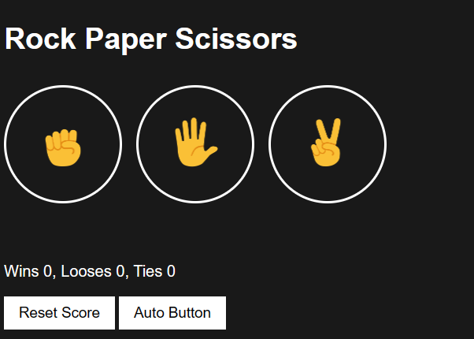
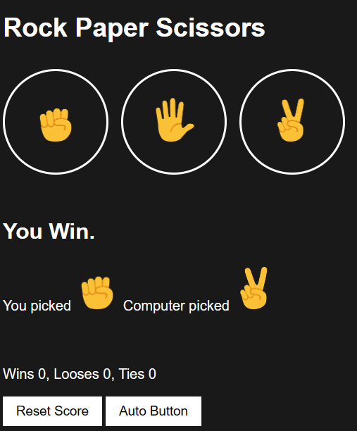

# Rock Paper Scissors Game
This is a simple Rock Paper Scissors game built using HTML, CSS, and JavaScript.

## Features
- Clickable images for rock, paper, and scissors.
- Determine the winner between the user and the computer.
- Score counter for wins, losses, and ties.
- Reset score button.
- Auto-play option.
- Keyboard shortcuts for quick moves (p for paper, r for rock, s for scissors).

## How to Play
1. Open index.html in your web browser.
2. Click on the images to make your move.
3. Use keyboard shortcuts (p for paper, r for rock, s for scissors) for quick moves.
4. The game will determine the winner, loser, or if it's a tie.
5. Use the reset score button to start over.
6. Press the auto-play button to let the game play automatically.

Enjoy playing Rock Paper Scissors!

## Screenshots
IMAGE 1:
 

IMAGE 2 : 
